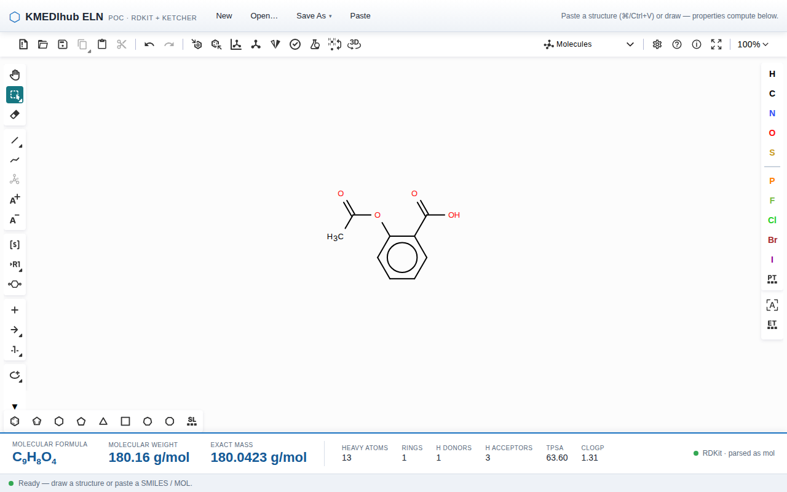

# KMEDIhub ELN PoC

전자연구노트(ELN)의 화학 기능을 **ChemDraw SDK 없이** 오픈소스 스택
(Ketcher + RDKit)으로 구현할 수 있음을 증명하는 기술 실현가능성 프로토타입.

> **증명해야 하는 단 하나:** 구조식을 붙여넣는 즉시, 하단에서 분자식·분자량이 자동 계산된다.



## 아키텍처

```
frontend/  React + TS + Vite, Ketcher 임베드
   │  구조 변경 → /api/properties (디바운스)      → 하단 물성 바
   │  Search…   → /api/search                     → 검색 패널
   ▼
backend/   FastAPI + RDKit
   ├─ app/chem/        물성 계산 (MolFormula/MolWt/ExactMolWt), 지문
   ├─ app/search/      ChemSearchBackend + 2 구현체
   │    ├─ PortableFPBackend   표준 SQL + BLOB  → Oracle SE 이식 대상
   │    └─ PgCartridgeBackend  RDKit 카트리지    → 개발/벤치 기준선
   └─ app/sdf/         재단 SDF 로더 + 정합(parity) 검증
```

**모든 표시 물성은 RDKit 계산값이다.** Ketcher/Indigo 는 에디터 조작에만 쓰인다.

## 핵심 설계 규칙

- **DB 이식성:** 화학 검색은 `ChemSearchBackend` 뒤에 숨긴다. `PortableFPBackend` 는
  `bit_count`/`ARRAY`/`@>`/`%` 같은 벤더 문법 없이 표준 SQL + BLOB 만 사용해 Oracle SE 로
  이식된다. 두 백엔드는 브루트포스 RDKit 기준과 **동일 결과**를 반환해야 한다(테스트 고정).
- **`.cdx` 바이너리 파싱 안 함:** ChemDraw 는 클립보드에 `text/plain` SMILES/MOL 도 올린다.
  paste 경로에서 그것을 받는다.
- **RDKit `None` 은 절대 삼키지 않는다:** 파싱/새니타이즈 실패는 명시적으로 표면화·집계한다.

## 실행

### Docker (권장)
```bash
make dev          # backend(RDKit) + frontend(nginx)  → http://localhost:3000
make dev CHEM_INDEX_SDF=/app/data   # data/ 의 SDF 를 색인
docker compose --profile pg up      # + Postgres 카트리지 기준선
```

### Docker 없이 (로컬)
```bash
make install-backend install-frontend
make backend      # FastAPI  :8000
make frontend     # Vite     :3000   (다른 터미널)
```

## 테스트 · 벤치 · 검증

```bash
make test         # pytest (74) + vitest (9) + 프론트 타입체크
make bench        # 성능 실측 → reports/bench.md
make parity       # SDF 정합 → reports/parity.md
make load-sdf     # data/*.sdf → SQLite 색인
```

## 산출물 (reports/)

- [`feasibility.md`](reports/feasibility.md) — 재단 제출용 구현 가능 여부 회신
- [`bench.md`](reports/bench.md) — 실측 성능 (p50/p95/p99)
- [`parity.md`](reports/parity.md) — RDKit vs SDF 필드 정합 검증

## 데이터

재단 실측 SDF 는 비공개이며 이 저장소에 포함되지 않는다(`.gitignore`). 넣는 위치는
`data/*.sdf`. 부재 시 파이프라인은 `backend/tests/fixtures/sample_foundation.sdf`
픽스처로 동작하며, 리포트에 픽스처 사용 사실을 명시한다.

## 현재 상태

**P0 6종 전부 구현·검증:** 물성 자동계산 · 구조 에디터(그리기/붙여넣기) · SDF/MOL/SMILES
입출력 · 3종 검색(substructure/exact/similarity, 양 백엔드) · Reaction Stoichiometry ·
Reagent Inventory 팝업.

잔여(운영 검증): 재단 실데이터 정합, Oracle SE 실계측, Docker 실기동.
자세한 내용은 [feasibility.md](reports/feasibility.md).
