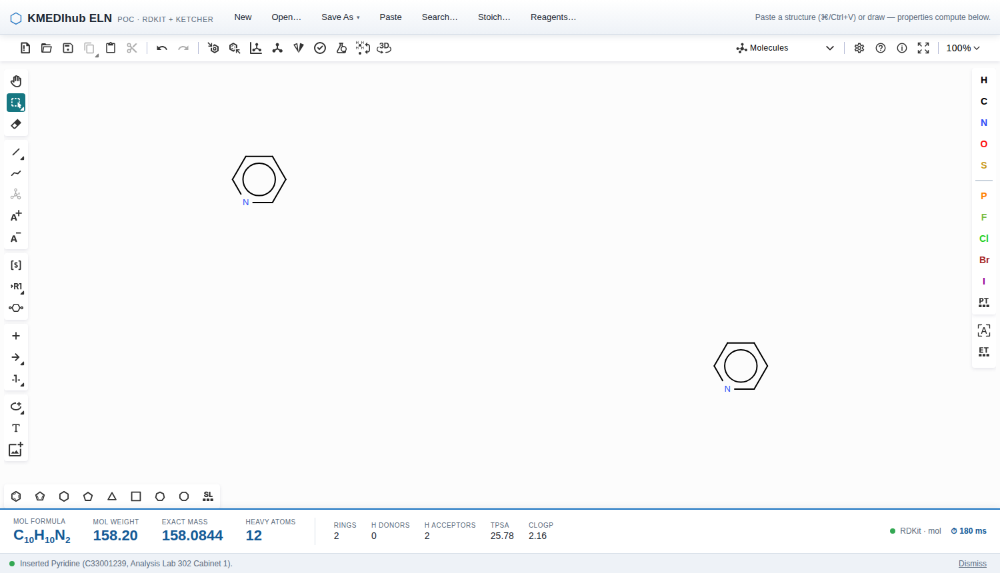

# KMEDIhub ELN PoC

전자연구노트(ELN)의 화학 기능을 **ChemDraw SDK 없이** 오픈소스 스택
(Ketcher + RDKit)으로 구현할 수 있음을 증명하는 기술 실현가능성 프로토타입.
기관 내부 구축형(폐쇄망 온프레미스) 전제 — 외부 CDN/네트워크 의존 없음.

> **증명해야 하는 단 하나:** 구조식을 붙여넣는 즉시, 하단에서 분자식·분자량이 자동 계산된다.
> 실측: E2E p50 **404 ms** / p95 **439 ms** (150 ms 디바운스 포함, Chromium 30회)

계약 문서: [docs/SPEC.md](docs/SPEC.md) · [docs/TASKS.md](docs/TASKS.md) ·
[docs/PRD.md](docs/PRD.md) · 결정 기록 [docs/DECISIONS.md](docs/DECISIONS.md)



## 아키텍처 (SPEC §1)

```
frontend/  React + TS + Vite — Ketcher 임베드
   │  KetcherPanel   구조 변경(디바운스 150ms) → /api/v1/chem/properties
   │  PropertyBar    Formula/MolWt/ExactMass/HeavyAtoms + ⏱ 실측 지연 표시
   │  StoichTable    합성노트 컬럼 그대로 — 계산은 전부 서버(/chem/stoich)
   │  SearchPanel    substructure/exact/similarity + elapsed_ms/backend 표시
   │  InventoryDialog Simple(Name/CAS/Location) | Structure 탭 → 캔버스 삽입
   ▼ REST /api/v1
backend/   FastAPI + RDKit
   ├─ app/chem/      properties · convert · standardize · fingerprint · stoich(순수)
   ├─ app/search/    ChemSearchBackend (CHEM_SEARCH_BACKEND 로 선택)
   │    ├─ PortableFPBackend   ★ Oracle SE 이식 경로 (기본)
   │    │    substructure: PatternFP 2048b → 32×64bit signed 워드 컬럼,
   │    │                  (pat_i & :q)=:q 스크리닝 → 앱단 RDKit 정밀 매칭
   │    │    similarity:  Morgan FP + popcount BETWEEN 가지치기
   │    ├─ PgCartridgeBackend  카트리지 기준선 (PG_DSN 필요)
   │    └─ BruteForceBackend   동치성 게이트의 ground truth
   ├─ app/sdf/       reader(임베드 다중컴포넌트) + writer(무손실 round-trip)
   └─ app/reagents/  시약 마스터 + Container(바코드/Location/Lot/Supplier)
```

**모든 표시 물성은 RDKit 계산값이다.** Ketcher/Indigo 는 에디터 조작에만 쓰인다.

## 핵심 설계 규칙

- **DB 이식성:** `PortableFPBackend` 는 표준 SQL + 정수/BLOB 컬럼만 사용
  (`bit_count`/`ARRAY`/`@>`/`%` 금지; 비트 `&` 는 Oracle `BITAND`). 동치성 게이트:
  **30개 substructure 쿼리에서 브루트포스 RDKit 과 결과 집합 완전 일치** (부분집합 아님).
- **SPEC §4.3 정정:** substructure 스크리닝은 Morgan 이 아니라 **PatternFingerprint**
  (Morgan 은 포함성이 성립하지 않아 false negative 발생 — [DECISIONS.md](docs/DECISIONS.md)).
- **Stoichiometry 는 방향성 있는 순수 함수** (`chem/stoich.py`, RDKit 불사용) — 재단
  합성노트 실측 케이스가 인쇄 자릿수까지 재현된다 (eq-입력 방향, DECISIONS.md).
- **`.cdx` 바이너리 파싱 안 함:** ChemDraw 는 클립보드에 `text/plain` SMILES/MOL 도 올린다.
- **RDKit `None` 은 절대 삼키지 않는다.** 그리고 **몰파일을 절대 `strip()/trim()` 하지
  않는다** — 빈 이름 줄이 구조의 일부다 (3곳에서 실제 발생, 회귀 테스트 고정).

## 실행

### Docker (권장)
```bash
make dev          # backend(RDKit) + frontend(nginx)  → http://localhost:3000
docker compose --profile pg up   # + Postgres 카트리지 기준선
```

### Docker 없이 (로컬)
```bash
make install-backend install-frontend
make backend      # FastAPI  :8000
make frontend     # Vite     :3000   (다른 터미널)
```

## 테스트 · 벤치 · 검증

```bash
make test         # pytest(172) + vitest + tsc
make bench        # 30쿼리 × 3규모(5,342/50k/500k) → reports/bench.md
make parity       # SDF 정합 → reports/parity.md
make load-sdf     # data/*.sdf → SQLite 색인
```

환경변수: `CHEM_SEARCH_BACKEND=portable_fp|pg_cartridge`, `CHEM_INDEX_SDF=<sdf 경로>`,
`PG_DSN=<postgres dsn>` (카트리지 기준선/동치성 테스트 편입용).

## 산출물 (reports/)

- [`feasibility.md`](reports/feasibility.md) — SPEC §9 6개 질문에 대한 실측 기반 회신
- [`bench.md`](reports/bench.md) — 실측 성능 (p50/p95/p99 + 스크리닝 후보수)
- [`parity.md`](reports/parity.md) — RDKit vs SDF 필드 정합

## 데이터

재단 실측 SDF 는 비공개이며 저장소에 없다(`.gitignore`). `data/*.sdf` 에 넣으면
`make load-sdf` / `make parity` 가 그것을 쓴다. 부재 시 픽스처로 동작하며 리포트에
픽스처 사용 사실이 명시된다. `STRUCTUREAGGREGATION`(ChemDraw 바이너리)은 보존만
하고 절대 파싱하지 않는다.
