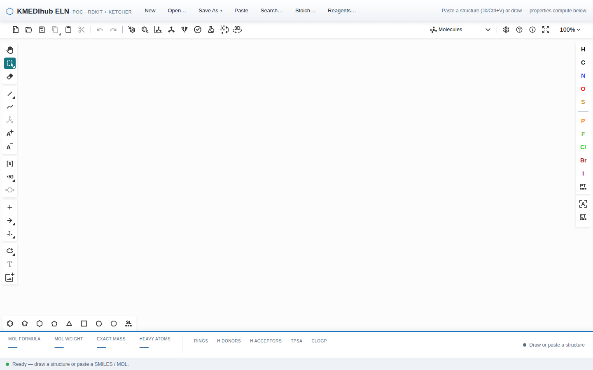
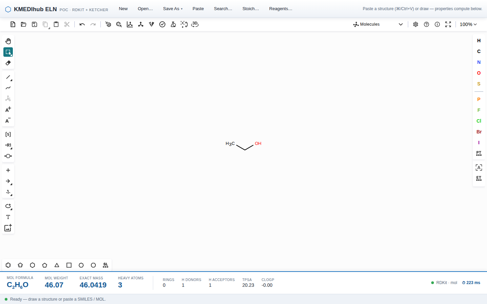
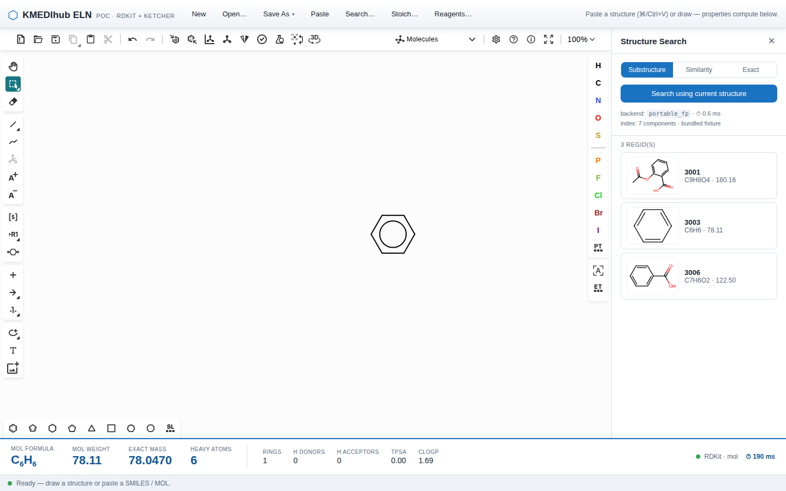
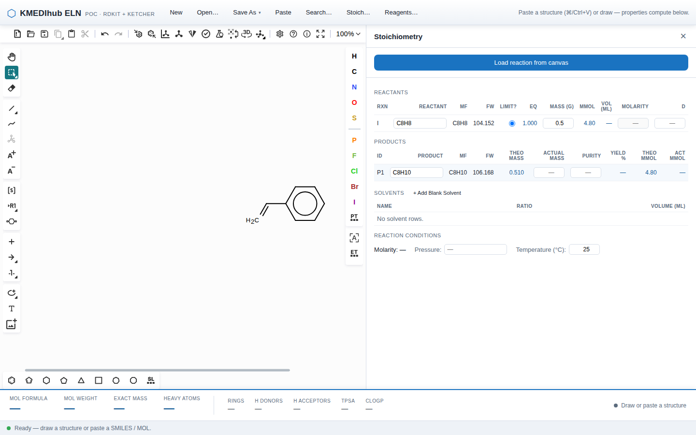
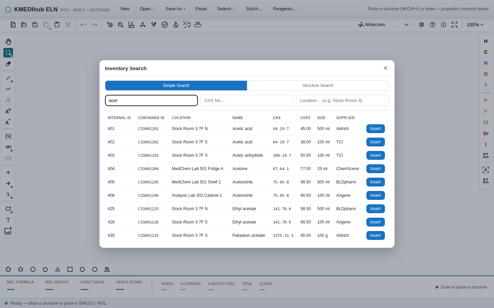

# KMEDIhub ELN PoC 사용자 매뉴얼

- **대상 독자**: 화학 비전공자를 포함한 일반 사용자 (연구원, 연구지원 인력)
- **최종수정일**: 2026-07-13
- **문서 성격**: 화면을 처음 보는 분도 따라 할 수 있도록 실제 버튼 이름 그대로 안내하는 사용 설명서입니다.

---

## 목차

1. [시작하기](#1-시작하기)
2. [5분 퀵스타트 — 에탄올 붙여넣고 분자량 확인하기](#2-5분-퀵스타트--에탄올-붙여넣고-분자량-확인하기)
3. [기능별 사용법](#3-기능별-사용법)
4. [자주 하는 작업 레시피](#4-자주-하는-작업-레시피)
5. [문제 해결](#5-문제-해결)
6. [단축키와 팁](#6-단축키와-팁)

---

## 1. 시작하기

### 1.1 접속 방법

1. 웹 브라우저(Chrome 또는 Edge 최신 버전 권장)를 엽니다.
2. 주소창에 **\<Vercel 배포 URL\>** 을 입력하고 Enter를 누릅니다.
3. 화면 왼쪽 위에 **KMEDIhub ELN** 로고가 보이면 접속에 성공한 것입니다.

별도의 프로그램 설치나 로그인은 필요하지 않습니다. 화학 계산은 백엔드 서버(`https://chemeditor.srv1711580.hstgr.cloud`)에서 수행되므로 인터넷 연결이 필요합니다.

> 처음 접속하면 하단 상태 바에 **"Loading chemistry engine…"** 이 잠시 표시됩니다. 화학 엔진(구조를 그리고 해석하는 프로그램)이 브라우저 안에서 로딩되는 중입니다. **"Ready — draw a structure or paste a SMILES / MOL."** 로 바뀌면 사용할 수 있습니다.

### 1.2 화면 구성

화면은 위에서부터 아래로 4개 영역으로 나뉩니다.

| 영역 | 위치 | 내용 |
|---|---|---|
| **상단 툴바** | 맨 위 | `New`, `Open…`, `Save As`, `Paste`, `Search…`, `Stoich…`, `Reagents…` 버튼이 한 줄로 있습니다. |
| **중앙 캔버스** | 가운데 (가장 넓음) | 구조식을 그리는 공간입니다. Ketcher(웹 브라우저용 화학 구조 편집기)가 내장되어 있으며, 좌우와 상단에 그리기 도구 아이콘이 있습니다. |
| **하단 물성 패널** | 캔버스 아래 | 캔버스의 구조가 바뀔 때마다 **Mol Formula(분자식), Mol Weight(분자량), Exact Mass(정밀질량), Heavy Atoms(수소 제외 원자 수)** 와 Rings, H donors, H acceptors, TPSA, cLogP가 자동으로 계산되어 표시됩니다. |
| **상태 바** | 맨 아래 | 방금 한 작업의 결과 메시지가 표시됩니다. 예: "Pasted structure from clipboard." 오류는 붉은색으로 표시되며 `Dismiss` 버튼으로 닫을 수 있습니다. |

상단 툴바 오른쪽에는 다음 안내 문구가 항상 표시됩니다.

> Paste a structure (⌘/Ctrl+V) or draw — properties compute below.
> (구조를 붙여넣거나 그리세요 — 아래에서 물성이 자동 계산됩니다.)

이 문구가 이 시스템의 핵심 사용법 전부입니다.

---

## 2. 5분 퀵스타트 — 에탄올 붙여넣고 분자량 확인하기

에탄올(술의 주성분인 알코올)의 SMILES(분자 구조를 한 줄 문자로 적는 표기법)는 `CCO` 입니다. 이 세 글자로 전체 흐름을 체험해 봅니다.

1. 메모장 등 아무 곳에나 `CCO` 를 입력하고 복사(Ctrl+C)합니다.
2. KMEDIhub ELN 화면으로 돌아와 캔버스를 한 번 클릭합니다. → 캔버스가 활성화됩니다.
3. 상단 툴바의 **`Paste`** 버튼을 클릭합니다. (또는 키보드에서 Ctrl+V)
4. → 캔버스에 에탄올 구조(탄소 2개 + 산소 1개 사슬)가 그려지고, 상태 바에 **"Pasted structure from clipboard."** 가 표시됩니다.
5. → 약 1초 안에 하단 물성 패널이 자동으로 갱신됩니다.
   - **Mol Formula**: C₂H₆O
   - **Mol Weight**: 46.07
   - **Exact Mass**: 46.0419
   - **Heavy Atoms**: 3
6. 물성 패널 오른쪽 끝에 **"RDKit · mol"** 과 함께 **⏱ (숫자) ms** 가 표시됩니다. → 이번 계산에 실제로 걸린 시간입니다. 별도 조작 없이 구조가 바뀔 때마다 자동으로 다시 계산됩니다.

여기까지 되면 시스템의 핵심 기능을 모두 확인한 것입니다.

---

## 3. 기능별 사용법

상단 툴바의 버튼 순서대로 설명합니다. 모든 버튼은 화학 엔진 로딩이 끝나기 전에는 비활성(회색)입니다.

### 3.1 `New` — 새 문서

1. 툴바의 **`New`** 를 클릭합니다.
2. → 캔버스가 비워지고 상태 바에 **"New document created."** 가 표시됩니다.
3. → 하단 물성 패널은 모두 `—` 로 돌아가고 **"Draw or paste a structure"** 안내가 표시됩니다.

> 주의: 되돌리기 확인 창이 없습니다. 지우기 전에 필요하면 먼저 `Save As`로 저장하세요.

### 3.2 `Open…` — 파일 불러오기

1. 툴바의 **`Open…`** 을 클릭합니다.
2. → 운영체제의 파일 선택 창이 열립니다.
3. 파일을 선택하고 열기를 누릅니다. 지원 확장자: **`.sdf` `.sd` `.mol` `.rxn` `.ket` `.smi` `.smiles` `.txt`** (모두 텍스트 형식이며, 형식은 자동 인식됩니다)
4. → 캔버스에 구조가 로드되고 상태 바에 **"Opened "파일명"."** 이 표시됩니다.
5. → 물성 패널이 자동 갱신됩니다.

> ChemDraw의 바이너리 `.cdx` 파일은 이 메뉴로 열 수 없습니다. ChemDraw 구조를 가져오는 방법은 [4.1 레시피](#41-chemdraw에서-복사해-붙여넣기)를 보세요.

### 3.3 `Save As` — 파일로 저장

1. 툴바의 **`Save As ▾`** 를 클릭합니다.
2. → 저장 형식 메뉴가 펼쳐집니다.

   | 메뉴 항목 | 용도 |
   |---|---|
   | **MDL SDfile (\*.sdf)** | 구조+데이터 파일. ELN 간 교환용 표준 형식 (권장) |
   | **MDL Molfile V2000 (\*.mol)** | 단일 구조 교환용 표준 형식 |
   | **MDL Molfile V3000 (\*.mol)** | 대형/쿼리 구조용 확장 형식 |
   | **MDL Rxnfile (\*.rxn)** | 반응식 교환 형식 |
   | **SMILES (\*.smi)** | 한 줄 문자 표기 |
   | **Ketcher document (\*.ket)** | 이 에디터 전용 형식 (무손실) |

3. 원하는 형식을 클릭합니다.
4. → 브라우저 다운로드로 `structure.(확장자)` 파일이 저장되고, 상태 바에 **"Saved as (형식명)."** 이 표시됩니다.
5. 캔버스가 비어 있으면 **"Nothing to export — the canvas is empty."** 오류가 표시됩니다.

### 3.4 `Paste` — 클립보드 붙여넣기

1. 다른 프로그램에서 SMILES 또는 MOL 텍스트를 복사합니다.
2. 툴바의 **`Paste`** 를 클릭합니다.
3. → 브라우저가 클립보드 접근 권한을 물으면 **허용**을 클릭합니다. (최초 1회)
4. → 구조가 캔버스에 추가되고 상태 바에 **"Pasted structure from clipboard."** 가 표시됩니다.
5. 클립보드가 비어 있으면 **"Clipboard is empty."**, 해석할 수 없는 내용이면 **"Paste failed: …"** 가 표시됩니다.

> 캔버스를 클릭한 뒤 키보드 **Ctrl+V** (Mac은 ⌘V)를 눌러도 됩니다.

### 3.5 `Search…` — 등록 화합물 구조 검색

캔버스에 그려진 구조를 검색어로 사용해, 시스템에 적재된 화합물 라이브러리를 검색합니다.

1. 캔버스에 검색할 구조를 그리거나 붙여넣습니다.
2. 툴바의 **`Search…`** 를 클릭합니다.
3. → 오른쪽에 **Structure Search** 패널이 열립니다. 패널 아래에는 `backend:`(검색 엔진 이름)와 `index:`(적재된 컴포넌트 수)가 표시됩니다.
4. 검색 방식을 선택합니다.

   | 버튼 | 의미 |
   |---|---|
   | **substructure** | 부분구조 검색 — 그린 구조를 "부분으로 포함"하는 화합물 찾기 |
   | **similarity** | 유사도 검색 — 그린 구조와 비슷한 화합물 찾기 |
   | **exact** | 완전일치 검색 — 정확히 같은 화합물 찾기 |

5. `similarity` 를 선택한 경우 → **"Tanimoto ≥ 0.50"** 슬라이더가 나타납니다. Tanimoto(두 분자의 유사한 정도를 0~1로 나타낸 점수)의 최소값을 조절합니다. 오른쪽으로 갈수록 더 비슷한 것만 찾습니다.
6. **`Search using current structure`** 버튼을 클릭합니다.
7. → 검색 중에는 버튼이 **"Searching…"** 으로 바뀌고, 완료되면 결과 목록이 나타납니다.
   - 상단에 **"N REGID(s)"** — 찾은 등록번호 개수
   - 각 결과: 구조 그림 + REGID(등록번호) + 분자식 · 분자량 (+유사도 검색이면 Tanimoto 점수)
8. 일치하는 것이 없으면 **"No matches."** 가 표시됩니다.
9. 캔버스가 비어 있으면 상태 바에 **"Draw or paste a query structure first."** 오류가 표시됩니다.
10. 패널 오른쪽 위 **×** 를 클릭하면 닫힙니다.

### 3.6 `Stoich…` — 반응식 몰수 계산표

캔버스에 그린 반응식(반응물 → 생성물)에서 각 물질의 필요량·수율을 자동 계산합니다.

1. 캔버스에 반응식을 그립니다. Ketcher의 **화살표(→) 도구**로 반응물과 생성물을 구분해야 합니다.
2. 툴바의 **`Stoich…`** 를 클릭합니다.
3. → 오른쪽에 **Stoichiometry** 패널이 열리고 **"Draw a reaction, then load it."** 안내가 보입니다.
4. **`Load reaction from canvas`** 버튼을 클릭합니다.
5. → 반응물(Reactants) / 생성물(Products) / 용매(Solvents) 표가 생성됩니다.
   - 반응물에는 I, II, III… 번호가, 생성물에는 P1, P2… 번호가 자동으로 붙습니다.
   - 첫 번째 반응물이 **Limit?** (한계 반응물 — 가장 먼저 소진되어 생성량을 결정하는 물질) 로 지정되고 Mass 0.5 g이 기본 입력됩니다.
6. 값을 편집하면 나머지가 자동 계산됩니다.
   - 한계 반응물의 **Mass (g)** 를 입력 → mmol과 다른 행의 필요량이 계산됩니다.
   - 다른 반응물의 **Eq**(당량 — 한계 반응물 대비 몇 배 몰수를 쓰는지) 를 입력 → 그 행의 Mass가 계산됩니다. 반대로 Mass를 입력하면 Eq가 계산됩니다.
   - **Limit?** 라디오 버튼으로 한계 반응물을 바꾸면 전체가 다시 계산됩니다.
   - **Molarity** 칸에 농도를 입력하면 용액 시약(예: n-BuLi 2.5 M)으로 취급되어 **Vol (ml)** 입력 → Eq가 계산됩니다.
   - **d** 칸에 밀도를 입력하면 액체 시약의 부피가 함께 계산됩니다.
7. 생성물 표에서 **Actual Mass**(실제 얻은 질량)를 입력합니다. → **Yield %** (수율)가 자동 계산됩니다. **Purity**(순도 %)는 기록용 입력칸으로, 수율 계산에는 반영되지 않습니다.
8. **`+ Add Blank Solvent`** 를 클릭하면 용매 행이 추가됩니다. Name/Ratio/Volume (ml)을 직접 입력합니다.
9. 맨 아래 **Reaction Conditions** 에서 전체 Molarity(자동 계산), Pressure(메모용), Temperature (°C, 기본 25)를 확인·입력합니다.
10. 캔버스에 화살표가 없는 그림만 있으면 **"Draw a reaction (reactants → products) on the canvas first."** 오류가 표시됩니다.

### 3.7 `Reagents…` — 시약 재고 검색

보유 시약(용기 단위 재고)을 검색해 그 구조를 캔버스에 삽입합니다.

1. 툴바의 **`Reagents…`** 를 클릭합니다.
2. → **Inventory Search** 대화창이 화면 가운데에 열립니다. 탭이 2개 있습니다.

**Simple Search 탭 (이름/CAS/위치로 검색)**

1. 세 입력칸 중 아무 곳에나 입력합니다.
   - `Substance name…` — 물질 이름
   - `CAS No…` — CAS 번호(화학물질 고유 등록번호, 예: 64-17-5)
   - `Location… (e.g. Stock Room 3)` — 보관 위치
2. → 입력을 멈추면 자동으로 검색됩니다. 검색 버튼을 누를 필요가 없습니다.
3. → 결과 표에 Internal ID / Container ID / Location / Name / CAS / Cost / Size / Supplier가 표시됩니다.

**Structure Search 탭 (구조로 검색)**

1. 먼저 대화창을 닫고 캔버스에 검색할 구조를 그린 뒤 다시 엽니다. (또는 미리 그려두고 엽니다)
2. **Structure Search** 탭을 클릭합니다.
3. **substructure** 또는 **exact** 모드를 선택합니다.
4. **`Search using canvas structure`** 를 클릭합니다.
5. 캔버스가 비어 있으면 **"Draw a structure on the canvas to search by structure."** 오류가 표시됩니다.

**결과에서 캔버스로 삽입하기**

1. 원하는 행 오른쪽 끝의 **`Insert`** 버튼을 클릭합니다.
2. → 해당 시약의 구조가 캔버스에 추가되고 대화창이 닫히며, 상태 바에 **"Inserted (이름) ((용기 ID), (위치))."** 가 표시됩니다.
3. 결과가 없으면 **"No containers found."** 가 표시됩니다.

---

## 4. 자주 하는 작업 레시피

### 4.1 ChemDraw에서 복사해 붙여넣기

ChemDraw는 구조를 복사할 때 화면에 안 보이는 텍스트(SMILES 또는 MOL)도 함께 클립보드에 올립니다. 이 시스템은 그 텍스트를 읽으므로 별도 변환이 필요 없습니다.

1. ChemDraw에서 구조를 선택하고 복사(Ctrl+C)합니다.
2. KMEDIhub ELN으로 전환합니다.
3. 툴바의 **`Paste`** 를 클릭합니다. (또는 캔버스 클릭 후 Ctrl+V)
4. → 구조가 캔버스에 나타나고 하단에 분자식·분자량이 즉시 계산됩니다.
5. 만약 **"Paste failed: …"** 가 뜨면, ChemDraw에서 **Edit → Copy As → SMILES** 로 복사한 뒤 다시 시도하세요.

### 4.2 SDF 파일 불러오기

1. 툴바의 **`Open…`** 을 클릭합니다.
2. 파일 선택 창에서 `.sdf` 파일을 선택합니다.
3. → 구조가 캔버스에 로드되고 상태 바에 **"Opened "파일명"."** 이 표시됩니다.
4. → 물성 패널이 자동 갱신되므로, 파일 속 분자량 기록과 화면의 **Mol Weight** 를 바로 대조할 수 있습니다.

### 4.3 유사 구조 찾기

"이 화합물과 비슷한 게 우리 라이브러리에 있었나?" 를 확인하는 절차입니다.

1. 기준이 되는 구조를 캔버스에 붙여넣거나 그립니다.
2. 툴바의 **`Search…`** 를 클릭합니다. → Structure Search 패널이 열립니다.
3. **similarity** 버튼을 클릭합니다.
4. **Tanimoto ≥ 0.50** 슬라이더를 그대로 두고(처음엔 넓게 잡는 것이 좋습니다) **`Search using current structure`** 를 클릭합니다.
5. → 결과가 Tanimoto 점수와 함께 나열됩니다. 점수가 1.000에 가까울수록 더 비슷한 화합물입니다.
6. 결과가 너무 많으면 슬라이더를 0.7 이상으로 올려 다시 검색합니다.

### 4.4 반응식 그리고 몰수 계산

예: A + B → C 반응에서 A 0.5 g으로 시작할 때 B가 몇 g 필요하고 C가 최대 몇 g 나오는지 계산합니다.

1. 캔버스에 반응물 A를 그립니다(또는 붙여넣기).
2. Ketcher 도구 모음에서 **화살표(→) 도구**를 선택해 A 오른쪽에 화살표를 그립니다.
3. 화살표 왼쪽에 B를, 오른쪽에 C를 배치합니다. (A와 B는 화살표 왼쪽, C는 오른쪽)
4. 툴바의 **`Stoich…`** → **`Load reaction from canvas`** 를 클릭합니다.
5. → 반응물 표에 A(I행), B(II행)가, 생성물 표에 C(P1행)가 생성됩니다. A가 한계 반응물로 Mass 0.5 g이 입력되어 있습니다.
6. A 행의 **Mass (g)** 를 실제 사용량으로 수정합니다. → A의 mmol이 계산됩니다.
7. B 행의 **Eq** 에 당량(예: 1.2)을 입력합니다. → B의 필요 Mass (g)가 자동 계산됩니다.
8. → 생성물 C 행의 **Theo Mass**(이론 수득량)가 자동 표시됩니다.
9. 실험 후 C의 **Actual Mass** 를 입력하면 → **Yield %** 가 계산됩니다.

---

## 5. 문제 해결

### 5.1 화면이 안 뜰 때 / 버튼이 눌리지 않을 때

| 증상 | 원인과 해결 |
|---|---|
| 페이지 자체가 열리지 않음 | 인터넷 연결과 주소(\<Vercel 배포 URL\>)를 확인하세요. 사내망 방화벽이라면 관리자에게 문의하세요. |
| 상태 바가 **"Loading chemistry engine…"** 에서 멈춤 | 화학 엔진(WASM) 다운로드가 오래 걸리는 상태입니다. 30초 이상 지속되면 새로고침(F5)하세요. 반복되면 다른 브라우저(Chrome)로 시도하세요. |
| 툴바 버튼이 모두 회색 | 엔진 로딩이 끝나지 않은 정상 상태입니다. 이때 버튼을 누르면 **"Editor is still loading — please wait a moment."** 가 표시됩니다. 잠시 기다리세요. |
| 물성 패널이 **"Cannot compute: /chem/properties returned 5xx"** 등 통신 오류 표시 | 계산 서버(`https://chemeditor.srv1711580.hstgr.cloud`)에 연결하지 못한 상태입니다. 잠시 후 구조를 살짝 수정해 재계산을 유도하거나, 지속되면 관리자에게 문의하세요. |

### 5.2 물성이 "—"로 나올 때

하단 물성 패널의 오른쪽 끝 문구를 먼저 확인하세요.

| 패널 표시 | 의미 | 해결 |
|---|---|---|
| **"Draw or paste a structure"** | 캔버스가 비어 있습니다. | 구조를 그리거나 붙여넣으세요. |
| **"Computing (RDKit)…"** | 계산 중입니다. | 잠시(보통 1초 이내) 기다리세요. |
| **"Cannot compute: RDKit could not parse/sanitize the molfile"** | 구조가 화학적으로 성립하지 않습니다(원자가 초과 등). 잘못 그린 결합이 있을 수 있습니다. | 문제 원자 주변 결합을 지우고 다시 그리세요. 예: 탄소에 결합 5개. |
| **"Cannot compute: RDKit could not parse SMILES: …"** | 붙여넣은 텍스트가 올바른 SMILES가 아닙니다. | 원본에서 다시 복사하거나 오타를 확인하세요. |
| **"Cannot compute: empty input"** | 빈 내용이 전송되었습니다. | `New` 후 다시 그리세요. |

정상 계산되면 이 자리에 **"RDKit · mol"** 처럼 엔진 이름과 입력 형식이 표시됩니다.

### 5.3 검색 결과가 0건일 때

**Structure Search 패널에 "No matches." 가 표시되는 경우** — 오류가 아니라 "조건에 맞는 것이 없다"는 정상 응답입니다.

1. 패널 하단의 **index:** 표시를 확인합니다. → `0 components` 라면 라이브러리가 아직 적재되지 않은 것입니다. 관리자에게 문의하세요.
2. **exact** 로 검색했다면 → **substructure** 나 **similarity** 로 바꿔 다시 검색해 보세요. 염(salt) 형태나 입체 표기 차이로 완전일치가 실패할 수 있습니다.
3. **similarity** 라면 → Tanimoto 슬라이더를 낮춰(예: 0.30) 범위를 넓혀 보세요.
4. 상태 바에 **"Search failed: …"** 가 표시되었다면 검색 자체가 실패한 것입니다. 쿼리 구조가 올바른지(물성 패널이 정상 계산되는지) 확인 후 재시도하세요.

**Inventory Search에 "No containers found." 가 표시되는 경우**

1. 이름 검색은 부분 일치입니다. 전체 이름 대신 앞 몇 글자만 입력해 보세요.
2. CAS 번호는 하이픈 포함 형식(예: `64-17-5`)을 확인하세요.

### 5.4 붙여넣기가 안 될 때

1. **"Clipboard is empty."** → 복사가 실제로 되지 않은 상태입니다. 원본에서 다시 복사하세요.
2. 브라우저의 클립보드 권한 요청을 **차단**했다면 `Paste` 버튼이 항상 실패합니다. → 주소창 왼쪽 자물쇠 아이콘 → 사이트 설정 → 클립보드를 **허용**으로 바꾸세요. 또는 캔버스 클릭 후 Ctrl+V를 사용하세요.
3. **"Paste failed: …"** → 클립보드 내용이 그림(이미지)뿐이고 텍스트가 없는 경우입니다. 원본 프로그램에서 SMILES/MOL 텍스트로 복사하세요. ([4.1](#41-chemdraw에서-복사해-붙여넣기) 참고)

---

## 6. 단축키와 팁

### 6.1 단축키

| 키 | 동작 |
|---|---|
| **Ctrl+V** (⌘V) | 캔버스에 구조 붙여넣기 — 툴바 `Paste` 와 동일 목적. 캔버스를 먼저 클릭해 두세요. |
| **Ctrl+C / Ctrl+X** | 선택한 구조 복사 / 잘라내기 (Ketcher 기본 기능) |
| **Ctrl+Z / Ctrl+Shift+Z** | 실행 취소 / 다시 실행 (Ketcher 기본 기능) |
| **Ctrl+A** | 캔버스 전체 선택 (Ketcher 기본 기능) |
| **Delete** | 선택한 부분 삭제 (Ketcher 기본 기능) |

이외의 그리기 단축키(원소 A, 결합 등)는 캔버스 도구 아이콘에 마우스를 올리면 나오는 풍선 도움말에서 확인할 수 있습니다.

### 6.2 팁

- **저장 버튼이 따로 없습니다.** 이 PoC는 자동 저장을 하지 않으므로, 작업 결과를 남기려면 반드시 `Save As` → **MDL SDfile (\*.sdf)** 로 내려받으세요. 브라우저를 새로고침하면 캔버스 내용이 사라집니다.
- **물성 패널의 ⏱ 숫자**는 구조 변경부터 화면 갱신까지 실제 걸린 시간(밀리초)입니다. 시스템 성능 평가 시 이 숫자를 기록하면 됩니다.
- **분자식·분자량은 모두 서버의 RDKit(오픈소스 화학 계산 라이브러리)이 계산**합니다. 캔버스에 그려진 그림과 아래 숫자는 항상 같은 구조를 가리킵니다.
- `Search…` 와 `Stoich…` 패널은 동시에 하나만 열립니다. 하나를 열면 다른 하나는 자동으로 닫힙니다.
- 검색 결과의 구조 그림이 안 보여도 REGID·분자식 텍스트는 정상입니다. 그림은 서버에서 별도로 그려오므로 네트워크가 느리면 늦게 나타날 수 있습니다.
- 캔버스에 **여러 분자를 함께** 두면 물성은 그 전체를 하나의 입력으로 계산합니다. 한 분자의 물성만 보려면 `New` 후 그 분자만 남기세요.
